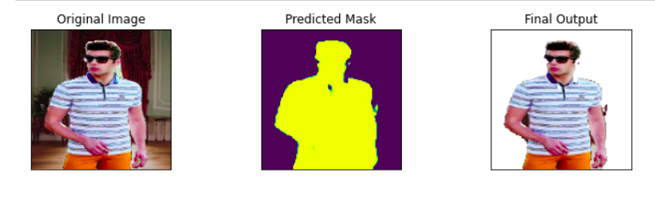

# Background Removal using Semantic Segmentation

This is deep learing model that can be used to remove background from the images. The technique used is semantic segmentation, where we classify each pixel into a particular class. Try out the model here - 

**What is semantic segmentation?**
Semantic segmentation refers to the process of linking each pixel in an image to a class label. These labels could include a person, car, flower, piece of furniture, etc., just to mention a few. We can think of semantic segmentation as image classification at a pixel level.

To know more about segmentation tasks in computer vision, begin with this insightful article by [Jeremy Jordan](https://www.jeremyjordan.me/semantic-segmentation/).

### Dataset
For this project, I used this dataset - https://www.kaggle.com/hngngn/portrait-segmentation-128x128 . The reason for choosing this one was that given my computational limitation, this dataset offered a pretty good value. It has around 18.5k samples for training and 3.5k for testing, along with their respective masks, and it takes only about 750MB storage.

### Model Architecture and Training
For this semantic segmentation task, I chose [U-Net](https://arxiv.org/abs/1505.04597) based Encoder-Decoder. The U-Net architecture was first published for medical image purposes but since then it has been found useful in many general applications as well. 

I didn't implement the whole of U-Net from scratch, instead I used a very good library called **[Segmentation-Models](https://segmentation-models.readthedocs.io/en/latest/install.html)** which provide a lot of utilities for semantic segmentation task, compatible with keras and tensorflow. From this library, I used the U-Net model with a **VGG** encoder whose weights were freezed. I had only one class to segment, and the loss function used for training was the Jaccard index or the IOU-Score, pre-defined in the segmentation-models library itself. Read this [article](https://towardsdatascience.com/metrics-to-evaluate-your-semantic-segmentation-model-6bcb99639aa2) to understand IOU-Score.

### Results and further work
The model converged quite satisfactorily, with 10 epochs of training in 12hrs. The IOU-Score on evaluation data was **0.981**.
One of the predictions has been shown below.

This model is deployed on the web - , check it out.

There's a lot that can be done in improving this work like using better, generalised datasets, more intricate architecture, latest SOTA techniques, etc. Meanwhile, read can see this [repository](https://github.com/anilsathyan7/Portrait-Segmentation) to know more about background removal using semantic segmentation.

